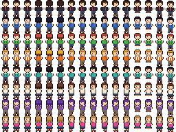

# OpenClaw Office

A 2D pixel art office visualization for OpenClaw agents. Watch your AI agents work in real time — they walk between desks, interact, and reflect actual session activity from your OpenClaw gateway.



## What It Is

A standalone web app that connects to your OpenClaw Gateway via WebSocket and renders a Kairosoft-style 2D office where each character represents a real agent role:

- **Boss** (you) — top office area
- **Assistant** — chief of staff, active when main session is typing
- **Subagent** — walks around when subagents are running
- **Cron** — at desk when cron jobs are executing
- **4 Channel Characters** — Telegram, Discord, Slack, Feishu (configurable)

Characters walk between desks using A* pathfinding, show speech bubbles with contextual messages, toss paper airplanes, and have clickable menus with session info, reports, and achievements.

## Quick Start

```bash
# Clone
git clone https://github.com/cmcintosh/openclaw-office.git
cd openclaw-office

# Install
npm install

# Run
npm run dev
```

Opens at `http://localhost:8843`.

On first load, you'll see a config overlay — enter your OpenClaw Gateway URL and token:
- **URL:** `ws://127.0.0.1:18789` (default for local OpenClaw)
- **Token:** Your gateway token from `~/.openclaw/openclaw.json`

Or pass via URL params: `http://localhost:8843/?gw=ws://127.0.0.1:18789&token=YOUR_TOKEN`

## Remote Access

The dev server listens on `0.0.0.0:8843`, so it's accessible from:
- **Local:** `http://localhost:8843/`
- **LAN:** `http://<your-ip>:8843/` (e.g., `http://192.168.1.136:8843/`)
- **Remote:** Via Tailscale, VPN, or SSH tunnel

For Tailscale access, use your Mac mini's Tailscale IP or hostname:
```
http://<mac-mini-tailscale-name>:8843/
```

## Auto-Start on Boot

A launchd agent is included:

```bash
cp ~/Library/LaunchAgents/com.openclaw.office.plist  # already installed
launchctl load ~/Library/LaunchAgents/com.openclaw.office.plist
```

Or use the start script:

```bash
/Volumes/Extreme\ Pro/Documents/openclaw-office/start.sh
```

## Characters & Activity Mapping

| Character | Role | Active When |
|-----------|------|-------------|
| Boss | You | Present if main session active in last 5 min |
| Assistant | Chief of Staff | Main session typing or recently active |
| Subagent | Worker | Subagent sessions running (10 min window) |
| Cron | Worker | Cron jobs executing (5 min window) |
| Channel 1-4 | Channel Workers | Messages on configured channels (5 min window) |

When active: character sits at desk. When inactive: character walks around the office, visits lounge, tosses paper airplanes.

## Configuration

### Channel Slots

Click any channel character to configure which OpenClaw channel they represent. Supports: Telegram, Discord, Slack, Feishu, WhatsApp, Google Chat, Signal, iMessage, Web Chat.

### Gateway Settings

Stored in `localStorage`. To reset:
```js
localStorage.removeItem('oc_gateway_url');
localStorage.removeItem('oc_gateway_token');
```

## Architecture

```
Browser (Canvas 2D)
  └── WebSocket ──→ OpenClaw Gateway (ws://127.0.0.1:18789)
       ├── sessions.list    → character activity
       ├── status           → agent name, memory count
       ├── channels.status  → channel connection states
       ├── sessions.usage   → cost/token tracking
       └── agents.list      → agent metadata
```

- **15 FPS** fixed timestep game loop
- **A* pathfinding** on a 15×35 tile grid
- **Sprite sheets** generated procedurally with @napi-rs/canvas
- **i18n** — English, German, Spanish, Japanese, Korean, Simplified Chinese
- **Single-file build** — production build produces one self-contained HTML file

## Origin

Forked from [Clawket](https://github.com/p697/clawket) (office-game module). Converted from React Native WebView + postMessage bridge to standalone web app with direct WebSocket connection to OpenClaw Gateway.

## License

AGPL-3.0-only